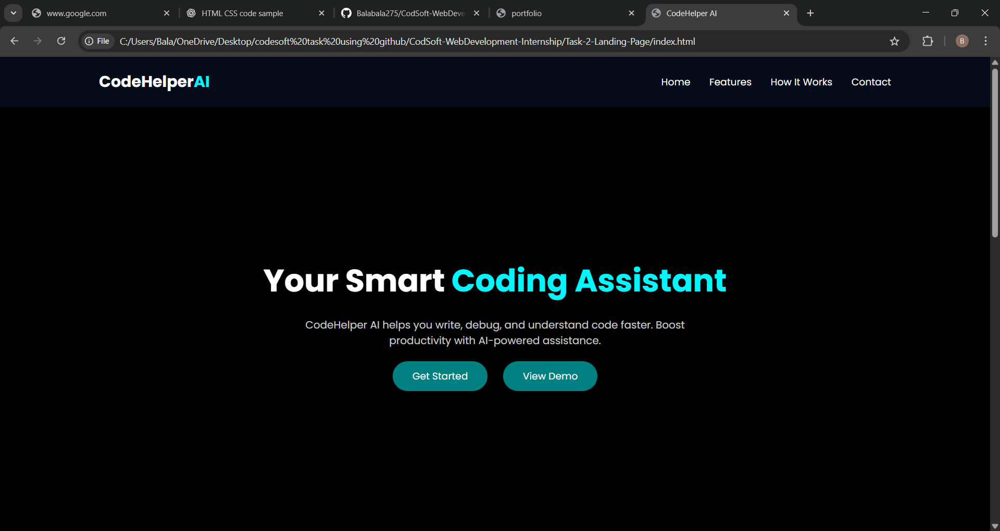

# CodSoft Web Development Internship

## Intern Name
Bala S

## Internship Domain
Web Development

## Internship Type
Virtual Internship

## Tasks Completed
- Task 1: Portfolio Website   
Description:
This is a personal portfolio website created using HTML, CSS, and JavaScript.
It showcases my skills, projects, and contact information with a clean and responsive design.
### 📸 Screenshot

### 🎥 Demo Video
🔗 [Watch on LinkedIn](https://www.linkedin.com/posts/bala-s-160562370_codsoft-portfolio-webdeveloper-activity-7409841570805608448-j4hL?utm_source=share&utm_medium=member_desktop&rcm=ACoAAFvrMFgB3pHwfP7G7adrHoZJjDfDDe-0Q6k)

- Task 2:Landing Page
Description:
This project is a landing page for a fictional AI tool called CodeHelper AI.
It is designed using HTML and CSS with a modern dark theme to present features and call-to-action sections.
### 📸 Screenshot

### 🎥 Demo Video
🔗 [Watch on LinkedIn](https://www.linkedin.com/posts/bala-s-160562370_codsoft-webdevelopment-html-activity-7409845661258440704-Hs3_?utm_source=share&utm_medium=member_desktop&rcm=ACoAAFvrMFgB3pHwfP7G7adrHoZJjDfDDe-0Q6k)

- Task 3: Calculator
Description:
This is a simple calculator application built using HTML, CSS, and JavaScript.
It performs basic arithmetic operations such as addition, subtraction, multiplication, and division
### 📸 Screenshot

### 🎥 Demo Video
🔗 [Watch on LinkedIn](https://www.linkedin.com/posts/bala-s-160562370_codsoft-javascript-webdevelopment-activity-7409849995929124864-3XW0?utm_source=share&utm_medium=member_desktop&rcm=ACoAAFvrMFgB3pHwfP7G7adrHoZJjDfDDe-0Q6k)
  

## Technologies Used
- HTML
- CSS
- JavaScript

## Description
This repository contains all the projects completed as part of the CodSoft Web Development Internship.
